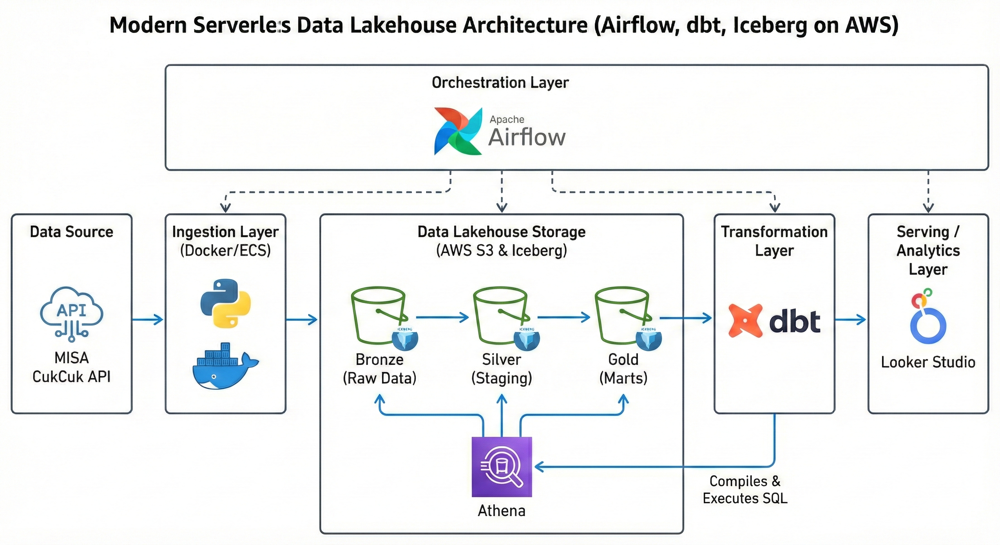
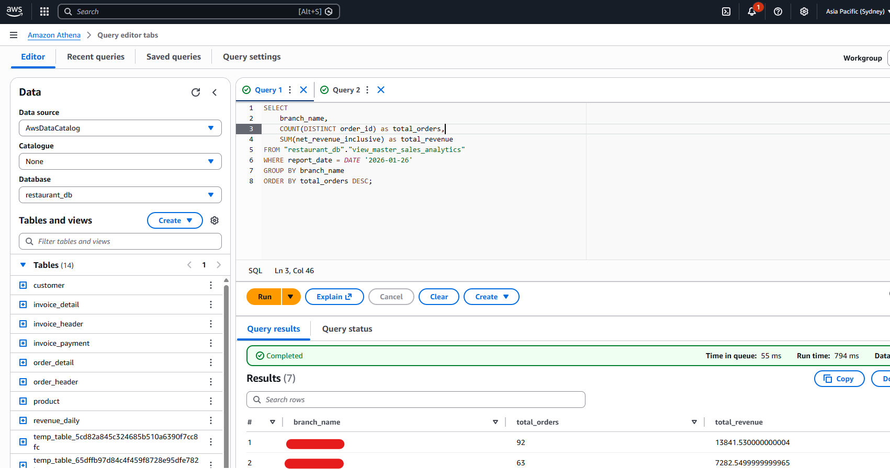

# 🥗 Serverless Restaurant Data Platform (Modern Data Stack)

    

## 📖 Overview

This project implements a scalable, resilient **Serverless Data Lakehouse** designed to ingest, transform, and analyze restaurant operations data (Sales, Inventory, Customers) from the CukCuk API.

Transitioning from legacy batch scripts, this platform adopts a **Modern Data Stack** architecture using **Apache Airflow** for orchestration, **dbt Core** for modular transformations, and **Apache Iceberg** on AWS S3 for ACID-compliant storage — a cost-effective alternative to traditional data warehouses.

---

## 🏗️ Architecture



### ELT Flow
1. Orchestration (Apache Airflow)
  - Manages the end-to-end dependency graph, scheduling, retries, and automated backfills.
2. Extraction (Python & AsyncIO)
  - High-throughput ingestion with `asyncio` and a Blind Batching strategy to handle API pagination.
  - Writes raw data to S3 in Apache Iceberg format (Bronze layer).
3. Transformation (dbt Core)
  - Staging: clean raw data, enforce schemas, type casting.
  - Marts: aggregate business metrics (Revenue, Retention) into analytics-ready tables.
  - Quality Gates: `dbt test` blocks execution if validations fail.
4. Serving (AWS Athena)
  - Serverless SQL queries directly on S3-backed Iceberg tables.
5. Analytics (Looker Studio)
  - Visualize KPIs for stakeholders.

---

## 💡 Key Technical Highlights

### 🚀 Resilient Orchestration & Self-Healing
- Automated backfills via specialized DAGs (e.g., `maintenance_weekly_backfill`) that detect gaps and re-run partitions.
- Idempotent jobs ensure consistent results on retries.

### ⚡ Cost-Effective "Merge-on-Read"
- Use Iceberg + dbt incremental models for optimized upserts instead of full-partition rewrites.
- Achieves significant cost savings for CDC and row-level updates.

### 🛡️ Data Quality First
- Schema validation and dbt business tests (e.g., `revenue > 0`, `order_date <= current_date`).
- Slack alerts for failures and anomalies.

---

## 🛠️ Tech Stack

| Category | Technology | Usage |
| :--- | :--- | :--- |
| Orchestration | Apache Airflow | Scheduling, DAGs, Backfilling (Docker) |
| Transformation | dbt Core | SQL transformations, testing, docs |
| Storage Format | Apache Iceberg | ACID, time-travel, schema evolution |
| Cloud Storage | AWS S3 | Bronze/Silver/Gold layers |
| Query Engine | AWS Athena | Serverless SQL |
| Language | Python 3.10 | Extractors (`asyncio`, `boto3`), Airflow operators |
| Infra | Docker | Local dev & reproducible environment |

---

## 📂 Project Structure

```text
data_pipeline_for_restaurant/
├── configs/                   # Configuration files (JSON)
├── dags/
│   ├── repos/
│   │   ├── dbt_project/       # dbt project (models, tests, seeds)
│   │   ├── scripts/           # Python script entrypoints (run_etl.py)
│   │   └── src/               # Core application logic (extractors, loaders)
│   ├── restaurant_etl_dag.py  # Main production DAG
│   └── weekly_backfill.py     # Maintenance/backfill DAG
├── docker-compose.yaml        # Airflow & local environment
├── Dockerfile                 # Custom Airflow image (dbt & AWS CLI)
└── requirements.txt           # Python deps
```

---

## 🚀 Quickstart

### Prerequisites
- Docker Desktop (4GB+ RAM recommended)
- AWS credentials with S3/Athena/Glue permissions

### 1. Setup environment
Create a `.env` file in the repo root:

```bash
AIRFLOW_UID=50000
AWS_ACCESS_KEY_ID=your_access_key
AWS_SECRET_ACCESS_KEY=your_secret_key
AWS_DEFAULT_REGION=ap-southeast-2
```

### 2. Configure AWS SSM (Secrets)
Ensure the following parameter exists in your AWS Systems Manager Parameter Store:

Path: /cukcuk/app_config

Type: SecureString

Content: Contains API tokens and Slack Webhook URL (JSON format).

### 3. Start the Platform
Run the entire stack using Docker Compose:
```bash
docker-compose up -d --build
```
### 4. Trigger the Pipeline
Access the Airflow UI at http://localhost:8080.

Login with default credentials: airflow / airflow.

Enable the restaurant_elt_pipeline DAG (toggle the switch to On).

Click the Trigger button (Play icon) to start the DAG manually or wait for the scheduled run.


**Pipeline Graph View:**

*Visualizing the dependency chain: Async Extraction (Python) → S3 Loading → dbt Transformation (Staging & Marts).*


---

### 5. Verify Data (AWS Athena)
Once the pipeline shows a `Success` status, you can query the transformed tables directly in AWS Athena to verify the results (e.g., aggregating Daily Revenue).



## 📊 Monitoring & Outputs
### Dashboard (Looker Studio)
Visualizing Daily Revenue, Order Volume, and Customer Retention.


### Slack Alerts
Real-time notifications for pipeline status (Success/Failure).


## 👨‍💻 Author
Tuan Le - Data Engineer

Project: Serverless Restaurant Data Platform

Focus: Building scalable, cost-effective data solutions using AWS & Modern Data Stack.