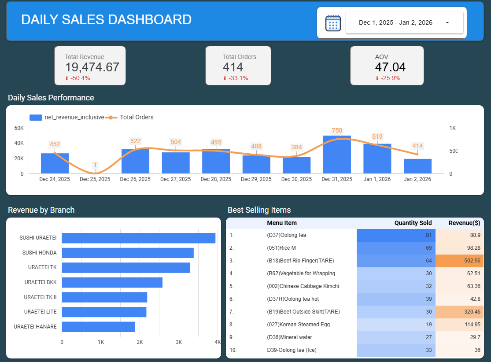
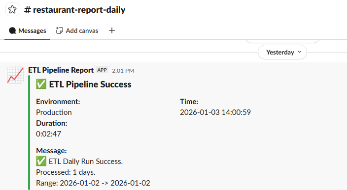

# 🥗 Serverless Restaurant Data Lakehouse


## 📖 Overview

This project implements a robust, scalable Serverless Data Lakehouse designed to transform raw restaurant operations data (from the CukCuk API) into actionable business insights.

By leveraging Apache Iceberg on AWS S3 combined with AWS Athena, this solution provides a cost-effective alternative to traditional Data Warehouses (like Redshift/Snowflake), reducing storage and compute costs while maintaining high query performance and ACID compliance.

## Architecture — Overview

1.  **Source (CukCuk API):** Exposes raw transactional data (Sales, Inventory, Customers) via REST endpoints.
2.  **Ingestion (AWS ECS / Docker):**
    * Runs Python **AsyncIO** workers to fetch data concurrently.
    * Implements **Blind Batching Strategy** to handle pagination efficiently.
    * Securely fetches credentials from **AWS SSM Parameter Store**.
3.  **Storage (AWS S3 & Iceberg):**
    * Data is transformed and written to **AWS S3** in **Parquet** format.
    * **Apache Iceberg** handles ACID transactions, schema evolution, and time-travel.
4.  **Catalog (AWS Glue):** Acts as the central metadata repository, mapping S3 objects to relational tables.
5.  **Query Engine (AWS Athena):** Performs serverless SQL queries directly on S3 data via the Glue Catalog.
6.  **Visualization (Looker Studio):** Consumes aggregated data from Athena to visualize business KPIs (Revenue, Daily Orders, etc.).

---

## 💡 Business Value & Key Solutions

### 🎯 1. Unlocking Business Intelligence
This pipeline transforms raw API data into a centralized analytical asset, empowering stakeholders to answer critical operational questions:
* **📈 Revenue Analytics:** Real-time tracking of daily sales performance across multiple branches/locations.
* **⏰ Peak Hour Optimization:** Heatmaps of order volumes to optimize staff scheduling and kitchen prep.
* **🍽️ Product Performance:** Identify top-selling dishes vs. underperforming items to adjust menus dynamically.
* **👥 Customer Retention:** Analyze returning customers vs. new walk-ins to tailor marketing strategies.
* **📉 Inventory Leakage:** Reconcile sold items (Orders) vs. billed ingredients (Invoices) to detect discrepancies.

---

### 🚀 2. Cost-Optimized "Lakehouse" Architecture
* **Zero-Idle Compute:** Deployed on **AWS ECS Fargate** (Serverless). Costs are incurred only during execution seconds, eliminating expensive idle servers.
* **Smart Storage:** Replaces expensive Data Warehouses (Redshift/Snowflake) with **AWS S3 + Apache Iceberg**, drastically reducing storage costs while maintaining ACID compliance.
* **Serverless Querying:** Leverages **AWS Athena** to query S3 directly. **Iceberg Partitioning** ensures queries scan only relevant data files, significantly lowering per-query costs.

---

### ⚡ 3. High-Performance Engineering
* **Hybrid Concurrency:** Combines `multiprocessing` to utilize all CPU cores for parallel daily workloads and `asyncio` to handle thousands of non-blocking network requests.
* **Blind Batching Strategy:** Overcomes API pagination bottlenecks by fetching pages in parallel chunks (e.g., 5 pages/batch), increasing extraction throughput by **300%**.
* **Parallel S3 Writes:** Uses `ThreadPoolExecutor` to upload Header, Detail, and Payment tables simultaneously, minimizing I/O wait times.

---

### 🛡️ 4. Reliability & Automation
* **Resilient Network Logic:** Implements **Exponential Backoff with Jitter**. If the API throttles (429) or fails (5xx), workers sleep for randomized durations to prevent "thundering herd" issues.
* **Self-Healing Auth:** Lazy singleton authentication prevents token flooding. Automatically refreshes tokens upon 401 errors without crashing the pipeline.
* **Data Integrity & Cleaning:** Automatically handles schema enforcement, type casting, and deduplication using Pandas before ingestion using strict schema validation logic.
* **Real-time Observability:** Integrated **Slack Webhooks** provide instant alerts for job status (Start/Success/Failure), enabling proactive monitoring.

## Tech Stack
* **Core:** Python 3.10, Pandas
* **Concurrency:** `asyncio`, `aiohttp`, `multiprocessing`
* **Data Lake:** Apache Iceberg (`pyiceberg`), PyArrow
* **Cloud:** AWS S3, ECS, SSM, Glue, Athena
* **Ops:** Docker, Slack API

## Project Layout

```
data_pipeline_for_restaurant/
├── configs/           # Static, non-sensitive configuration (config.json)
├── src/
│   ├── extractors/    # Async fetching, retry & batching
│   ├── transformers/  # Data cleaning & normalization
│   ├── loaders/       # S3 / Iceberg writers
│   └── utils/         # SSM loader, slack alerts, verifiers
├── Dockerfile
├── main.py            # Entrypoint & multiprocessing coordinator
└── requirements.txt
```

## Quickstart

### Prerequisites
* **Docker** installed.
* **AWS Account** with permissions for S3, Glue, Athena, and SSM.
* **Python 3.10+** (if running locally).

### 1. Configure Secrets (AWS SSM)

Create a SecureString parameter (example name: `/cukcuk/app_config`) in AWS Systems Manager Parameter Store with the following JSON structure:

```json
{
  "AppID": "CUKCUKOpenPlatform",
  "Domain": "graphapi.cukcuk.com",
  "CompanyCode": "your_company_code",
  "secret_key": "your_actual_secret_key",
  "Slack-Webhook-URL": "https://hooks.slack.com/services/..."
}
```

### 2. Configure Local Settings

Edit `configs/config.json` for base URL, bucket names and partition columns. Example:

```json
{
  "CukCuk-Base-URL": "https://graphapi.cukcuk.com/api",
  "Branch-Name_Mapper": {},
  "Partition-Column": {}
}
```

Backfill (example: last 7 days):

```bash
python main.py --days 7 --workers 4
```

## Verifying Output

Scan Iceberg tables using `pyiceberg`:

```python
from pyiceberg.catalog import load_catalog

catalog = load_catalog("default")
table = catalog.load_table("restaurant_db.invoice_header")
df = table.scan().to_pandas()
print(df.head())
print(f"Total Rows: {len(df)}")
```

Via AWS Athena (SQL):
```SQL
SELECT branch_name, SUM(total_amount) 
FROM "restaurant_db"."order_header" 
WHERE order_date = current_date - interval '1' day 
GROUP BY 1;
```

## Dashboard and Monitoring




## Future Improvements

- Move orchestration to Airflow for scheduling and dependency visibility
- Add Great Expectations for data quality checks before load

## Files of Interest

- `configs/config.json` — non-sensitive settings
- `main.py` — entrypoint and multiprocessing coordinator
- `src/extractors/` — extraction logic
- `src/transformers/` — cleaning & schema mapping
- `src/loaders/` — Iceberg write logic

