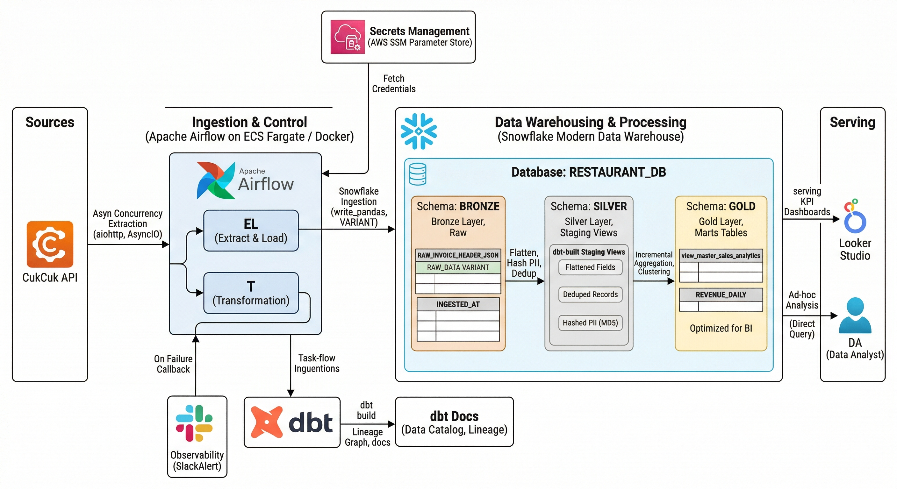
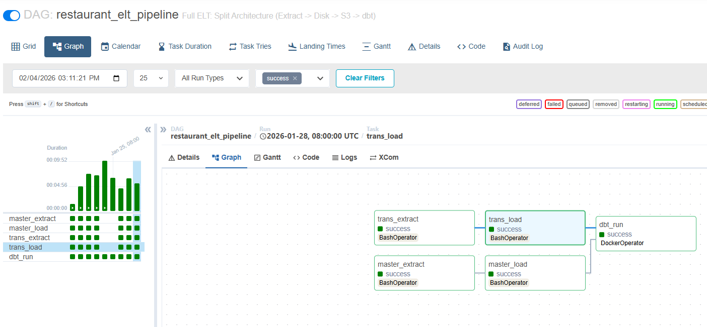
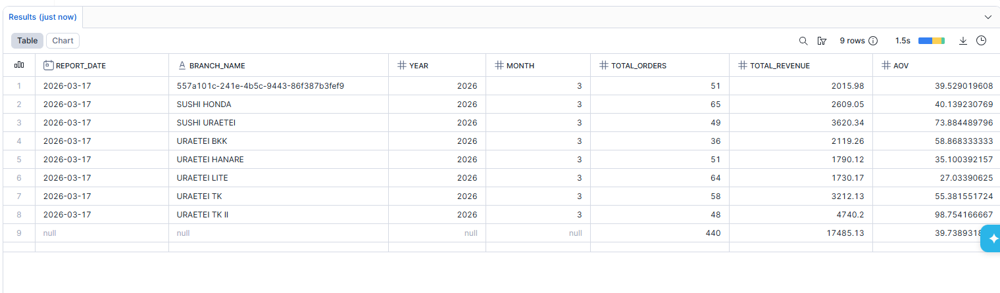
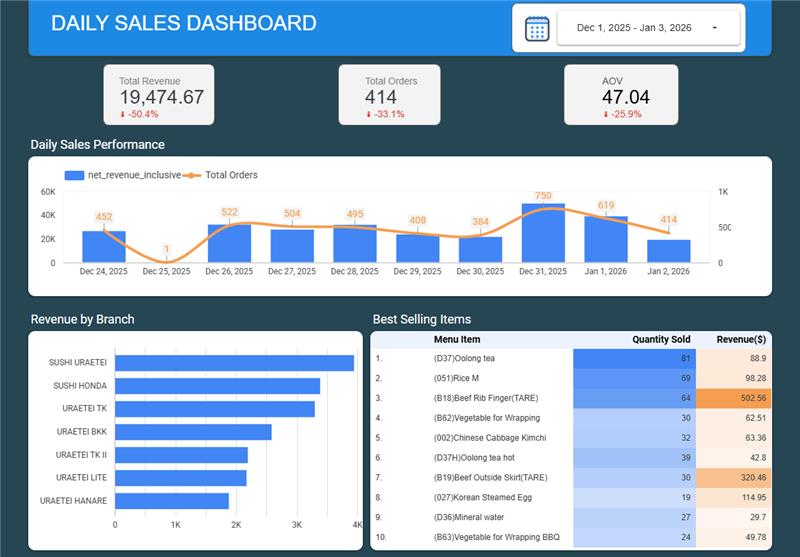
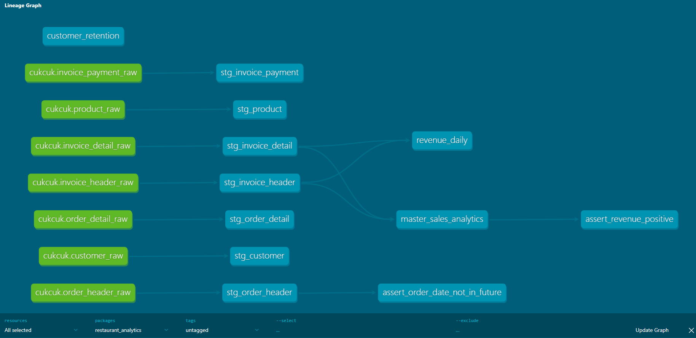
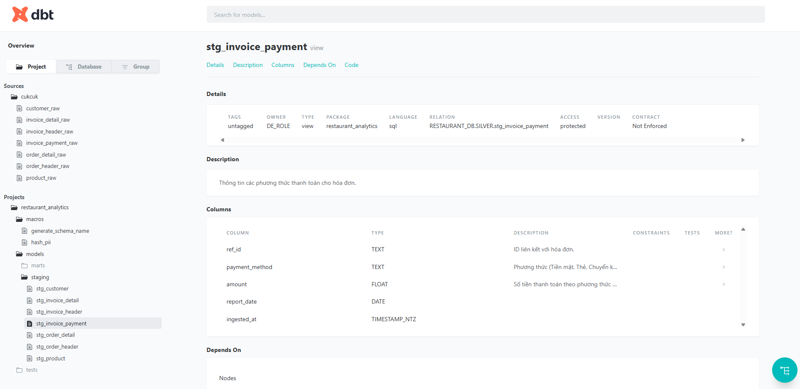
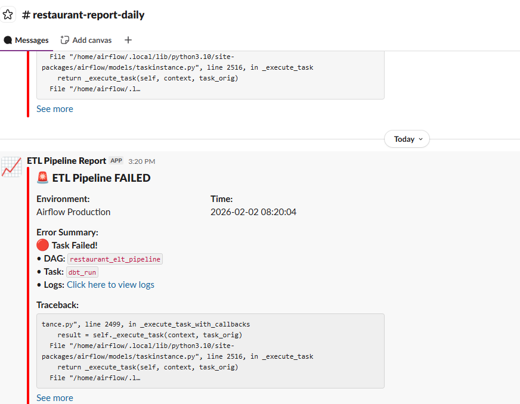

# 🥗 Serverless Restaurant Data Platform (Modern Data Stack)

    

## 📖 Overview

This repository features a robust, production-grade ELT Pipeline designed to ingest, transform, and analyze restaurant operations data (Sales, Invoices, Customers, Products) from the CukCuk API.

By leveraging Asynchronous Python for ingestion and dbt Core for modeling within Snowflake, the platform transforms raw JSON objects into high-performance analytical datasets. It follows the Medallion Architecture to ensure data reliability and governance at every stage.

---

## 🏗️ Architecture



### The pipeline implements a Medallion Architecture entirely hosted within Snowflake:
1. Extraction (Python AsyncIO): High-concurrency ingestion using aiohttp and asyncio.gather with semaphores to maximize throughput while respecting API rate limits.
2. Bronze Layer (Raw): Data is loaded into Snowflake as JSON VARIANT objects. This ensures no data loss from the source and allows for schema-on-read flexibility.
3. Silver Layer (Staging): dbt views flatten the JSON, enforce data types, deduplicate records using ROW_NUMBER(), and anonymize PII (Names, Phone Numbers) via MD5 Hashing.
4. Gold Layer (Marts): Final tables optimized for BI tools. This layer includes Incremental Models for sales analytics and daily revenue metrics, providing high efficiency and low compute costs.

---

## 💡 Key Technical Highlights

### 🚀 High-Performance Async Ingestion
- The Python extractor uses asyncio to fetch headers and details in parallel. It handles authentication signatures and token refreshing automatically, ensuring the pipeline can scale to thousands of daily transactions without bottlenecking.

### 🛡️ Data Governance & Quality
- PII Hashing: Custom dbt macros (hash_pii) ensure that sensitive customer data is never stored in plain text in analytical layers.
- Data Quality Gates: Automated dbt tests (Unique, Not Null, Custom SQL assertions) block bad data from reaching the Gold layer.
- Slack Observability: Integrated SlackAlert utility sends real-time success/failure notifications with direct links to Airflow logs.

### 🔄 Resilience & Self-Healing
- Idempotent Loads: The system uses MERGE strategies and deduplication logic to ensure that re-running the same date doesn't result in duplicate data.
- Weekly Backfill DAG: A dedicated maintenance pipeline allows for automated historical data re-processing to ensure long-term data integrity.

---

## 🛠️ Tech Stack

| Category | Technology | Usage |
| :--- | :--- | :--- |
| Orchestration | Apache Airflow | Scheduling, DAGs, Backfilling (Docker) |
| Transformation | dbt Core | SQL transformations, testing, docs |
| Data Warehouse | Snowflake | Hosting Bronze (Raw), Silver (Staging), and Gold (Marts) |
| Extraction | Python (AsyncIO) | High-speed API ingestion via aiohttp |
| Secret Management | AWS SSM | Secure storage for API keys and database credentials |
| Infra | Docker | Containerized Airflow environment for portability |

---

## 📂 Project Structure

```text
data_pipeline_for_restaurant/
├── configs/                   # Configuration files (JSON)
├── dags/
│   ├── repos/
│   │   ├── dbt_project/       # dbt project (models, tests, seeds)
│   │   ├── scripts/           # Python script entrypoints (run_etl.py)
│   │   └── src/               # Core application logic (extractors, loaders)
│   ├── restaurant_etl_dag.py  # Main production DAG
│   └── weekly_backfill.py     # Maintenance/backfill DAG
├── docker-compose.yaml        # Airflow & local environment
├── Dockerfile                 # Custom Airflow image with dbt & Snowflake drivers
└── requirements.txt           # Python deps
```

---

## 🚀 Quickstart

### Prerequisites
- Docker & Docker Compose
- A Snowflake Account
- AWS Credentials (for SSM Parameter Store access)

### 1. Setup environment
Create a `.env` file in the repo root:

```bash
AIRFLOW_UID=50000
AWS_ACCESS_KEY_ID=your_access_key
AWS_SECRET_ACCESS_KEY=your_secret_key
AWS_DEFAULT_REGION=ap-southeast-2
```

### 2. Configure AWS SSM (Secrets)
Ensure the following parameter exists in your AWS Systems Manager Parameter Store:

Path: /cukcuk/app_config

Type: SecureString

Content: Contains API tokens and Slack Webhook URL (JSON format).

### 3. Start the Platform
Run the entire stack using Docker Compose:
```bash
docker-compose up -d --build
```
### 4. Trigger the Pipeline
Access the Airflow UI at http://localhost:8080.

Login with default credentials: airflow / airflow.

Enable the restaurant_elt_pipeline DAG (toggle the switch to On).

Click the Trigger button (Play icon) to start the DAG manually or wait for the scheduled run.


**Pipeline Graph View:**

*Graph View: Async Extraction → Snowflake Ingestion → dbt Build (Staging & Marts).*



---

### 5. Verify Data (Snowflake)
Once successful, log in to your Snowflake Snowsight console to query the analytical layers:
```sql
-- Check Daily Revenue in Gold Layer
SELECT * FROM RESTAURANT_DB.GOLD.REVENUE_DAILY LIMIT 10;
```



## 📊 Monitoring & Outputs
### Dashboard (Looker Studio)
Visualizing Daily Revenue, Order Volume, and Customer Retention.



### dbt Documentation
Interactive lineage and data dictionary hosted on port 8001:
Lineage Graph: Visualizes the journey from Raw JSON to Business KPIs.



Schema Docs: Column descriptions and test results.



### Slack Alerts
Real-time notifications for pipeline status (Success/Failure).



## 👨‍💻 Author
Tuan Le - Data Engineer

Focusing on building scalable, cost-effective Data Platforms using the Modern Data Stack.